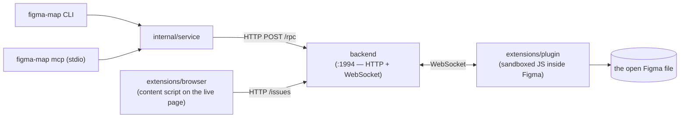
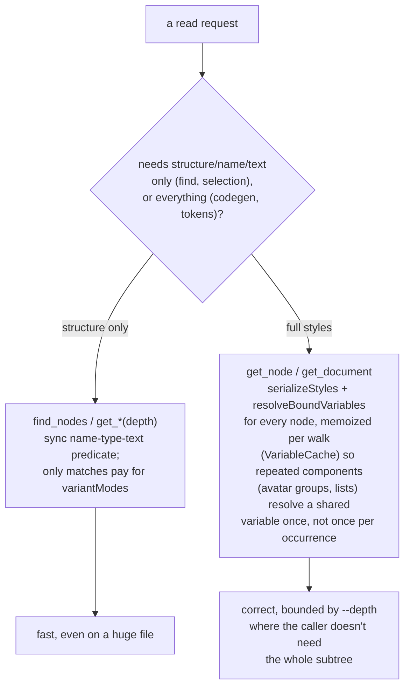
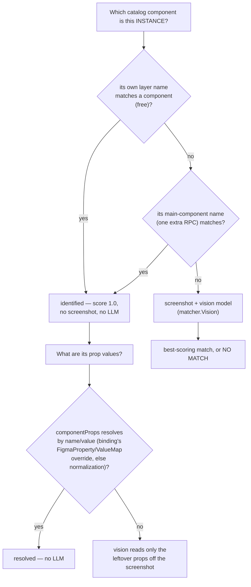

<div align="center">

# figma-map

**The ground-truth layer that lets AI coding agents build pixel-perfect UI from Figma.**

Agents that build from a screenshot guess. figma-map gives them exact
structure and tokens to build from, and a closed verify loop — render the
implementation, diff its real DOM against the design's exact values — so the
agent knows precisely what's still wrong instead of eyeballing "looks about
right."

[](https://github.com/KirillBaranov/figma-map/actions/workflows/ci.yml)
[](https://pkg.go.dev/github.com/kirillbaranov/figma-map)
[](https://goreportcard.com/report/github.com/kirillbaranov/figma-map)
[](https://github.com/KirillBaranov/figma-map/releases)
[](LICENSE)

</div>

---

```jsonc
// verify reconcile 55:1140 --story cta-banner
{ "match": false, "remaining": 2, "byElement": [
    { "nodeId": "55:1140", "name": "CTA", "diffs": [
        { "prop": "background-color", "is": "rgb(31,41,55)", "should": "#18181b" },
        { "prop": "padding-left", "is": "12px", "should": "16px" } ] } ] }
```

That's the primitive everything else is built on: not "does this look
right," but *exactly* which element, which property, which value — an agent
can act on that and loop until it's gone.

## Features

- **A closed verify loop, not a screenshot to eyeball.** `verify reconcile`
  renders your implementation, reads its actual DOM, and diffs computed
  styles against the design's exact tokens: per-element `is → should`
  numbers. `verify pixeldiff` adds a worst-region breakdown for anything
  text-diffing can't catch. This is what makes an otherwise-unreliable agent
  converge instead of guessing forever.
- **Ground truth before vision, everywhere.** Node structure, exact
  tokens, component identity, and prop values are read straight from Figma —
  instance name, main-component name, `componentProps`, bound-Variable
  `codeSyntax` — whenever Figma already has the answer. A vision model is the
  fallback for the one question Figma's data model can't answer (*which code
  component is this?*), never the default.
- **AI runs once, codegen runs forever.** That one vision-dependent question —
  matching your Figma library to your code library — is answered once, via
  `bind`, into a reviewable `figma-map.binding.yaml`. Every `map`/`plan`/
  `codegen`/`verify` call after that is plain, repeatable, CI-friendly code —
  no LLM in the hot path.
- **MCP-native.** Every CLI command is generated from the same registry as an
  MCP tool (`figma_find`, `build_plan`, `verify_reconcile`, …) — point an
  agent at it and it gets the identical surface, flags included, with zero
  drift between the two.
- **Closes the loop on live pages too.** A browser extension flags a mismatch
  a human spots on a running page and links it to its Figma node — the agent
  picks that up as structured ground truth (`capture issues`), never a raw
  pixel guess.
- **No Figma REST rate limits.** A bridge plugin running inside your open
  Figma file talks to figma-map directly over a local WebSocket — no API
  token, no per-minute request ceiling, no waiting on Figma's API quota.
- **Honest about what it can't do.** Unmatched components, untagged DOM
  elements, and unresolved props are reported explicitly (`unmapped`,
  `unmeasured`, a vision fallback that still failed) — never silently guessed.

## Contents

- [Features](#features)
- [Why](#why)
- [How it works: the agent loop](#how-it-works-the-agent-loop)
- [Component identity: bind → apply](#component-identity-bind--apply)
- [Install](#install)
- [Quick start](#quick-start)
- [Commands](#commands)
- [MCP integration](#mcp-integration)
- [Configuration](#configuration)
- [Architecture](#architecture)
- [Limitations](#limitations)
- [Contributing](#contributing)
- [License](#license)

## Why

Pointing an agent at a Figma screenshot and asking it to "build this" mostly
works — until it doesn't, and there's no way to tell *how far off* without a
human eyeballing a diff. The agent picked a color close enough, a padding
that's 4px short, the wrong variant of your `<Button>` — and nothing in the
loop can tell it that, so it stops when it *looks* done, not when it *is*
done.

figma-map closes that loop. It reads Figma's actual data — not a rendered
picture of it — for structure, tokens, and (via a one-time binding) component
identity, and it can re-render the agent's own output and diff it against
that same ground truth, property by property. The agent gets exact numbers to
fix, not vibes to interpret, so the loop actually converges on the design
instead of stalling on "close enough."

## How it works: the agent loop

figma-map doesn't build the page — the agent does, and figma-map is a
deterministic instrument it drives at each step (see
[ADR-0001](docs/adr/ADR-0001-dumb-tool.md): it measures, it doesn't guess).

1. **`build plan <nodeId>`** → a buildable spec: layout, each component
   instance mapped to your code (import + props), exact tokens, and an honest
   list of what couldn't be mapped.
2. The agent **writes the code**, stamping each element with
   `data-figma-node="<id>"` so it can be measured later. Unmapped pieces are
   hand-built from `figma tokens`; assets come from `capture export` (not
   regenerated).
3. The agent **renders** it (a Storybook story or a dev-server URL).
4. **`verify reconcile <nodeId> --story <id>`** (or `--url`) renders the
   implementation, reads its DOM computed styles, and diffs them against the
   design's exact tokens, returning per-element `is`/`should` numbers (see the
   example at the top).
5. The agent **fixes the exact properties** and loops from step 3 until
   `match: true`. Add `--semantic` for an LLM check of missing elements /
   wrong assets that numbers can't catch.

A ready-made agent skill ships at
[`.claude/skills/figma-map/SKILL.md`](.claude/skills/figma-map/SKILL.md): it
teaches an agent this loop, the `data-figma-node` contract, and when to use
each operation. Claude Code picks it up automatically when figma-map work
comes up.

## Component identity: bind → apply

Step 1 of the loop above (`build plan`) needs to know *which* code component
a Figma instance is. That mapping is the one place vision is unavoidable —
Figma's data model has no field for "this is our `<Button>`" — so it's solved
once, up front, into a reviewable artifact, `figma-map.binding.yaml`. The AI
runs **once**, during `bind`; everything downstream is deterministic and
CI-friendly.

```text
  Storybook ──scan──▶  catalog/            (screenshots + import paths, no AI)
                          │
  Figma ────────────────┐ │
                        ▼ ▼
                  bind  (vision LLM, once)  ──▶  figma-map.binding.yaml
                                                       │  ← you review it
                                                       ▼
  Figma node ──── map (deterministic) ───────────▶  JSX
```

1. **`scan`** — screenshot every Storybook story into a code-component catalog.
2. **`bind`** *(AI, once)* — match each Figma component section to the catalog
   and infer each component's prop schema → write `figma-map.binding.yaml`.
3. **review the binding** — it is a draft; correct anything the model got wrong.
4. **`map`** *(cheap, repeatable)* — for any Figma node, identify its component
   and prop values from the binding and emit JSX.

## Install

One line — detects your OS/arch, downloads the matching release, verifies its
SHA-256 checksum, and installs the binary:

```bash
curl -fsSL https://raw.githubusercontent.com/KirillBaranov/figma-map/main/install.sh | sh
```

Overrides: `FIGMA_MAP_VERSION=v0.1.0` to pin a tag, `FIGMA_MAP_INSTALL_DIR=~/bin`
to choose the directory.

With Go:

```bash
go install github.com/kirillbaranov/figma-map@latest
```

Or download a prebuilt archive from the
[releases page](https://github.com/KirillBaranov/figma-map/releases).

### Requirements

| Dependency | Why |
|---|---|
| **Google Chrome / Chromium** | headless screenshots of Storybook stories |
| **Storybook 7+** running | exposes the `index.json` story manifest |
| **backend + extensions/plugin running** | connects an open Figma file to a local server on `:1994`, bypassing Figma API rate limits — `figma-map bridge up --repo <path to this checkout>` builds and starts it for you (set `bridgeRepo` in `figma-map.yaml` to skip `--repo`), or run `npm --prefix backend run build && node backend/dist/index.js` by hand. Either way, still load the plugin in Figma once (Plugins → Development → Import from manifest, `extensions/plugin/manifest.json`) |
| **OpenAI-compatible vision endpoint + key** | matching and prop inference (works with OpenAI, a local Ollama/llava server, or any compatible gateway via `llm.baseURL`) |

## Quick start

```bash
figma-map init /path/to/your/project          # skill, figma-map.yaml, MCP registration, CLAUDE.md
cd /path/to/your/project                      # (or pass no path to pick one interactively)
export OPENAI_API_KEY=sk-...

figma-map doctor                              # verify bridge, chrome, storybook, key

# 1. Build the code-component catalog (no AI).
#    --project points at the repo containing your *.stories.tsx files.
figma-map setup scan --project /path/to/storybook-project

# 2. Match Figma to the catalog and write the binding (AI, run once).
figma-map setup bind
#    → review figma-map.binding.yaml

# 3. Generate code for any Figma node.
figma-map build map 13:1077
```

`init` never clobbers what's already there — it prints exactly what it's
about to create/change and asks for confirmation first (`-y` to skip that for
scripts), skips `figma-map.yaml` if one already exists, and only touches
`CLAUDE.md`/`.mcp.json` inside a delimited section it can safely re-run
later. Skipping it, `cp figma-map.example.yaml figma-map.yaml` still works
exactly as before — `init` is a shortcut for that plus the skill/MCP wiring,
not a replacement for the config format.

## Commands

Commands are grouped by what they do — `figma-map <group> <verb>` on the CLI,
a flat `group_verb` MCP tool name (e.g. `figma_find`) for agents.

| Group | Command | Description | Uses AI |
|---|---|---|:---:|
| — | `figma-map doctor` | Check bridge, Chrome, Storybook, and API key | — |
| **bridge** (local backend process) | `bridge up [--repo]` | Start the backend if nothing's listening yet (builds it first if needed) | — |
| | `bridge status` | Check whether the backend is reachable, and its pid/log | — |
| | `bridge down` | Stop the backend `bridge up` started | — |
| **figma** (read Figma ground truth) | `figma find <query>` | Search nodes by name/text/type | — |
| | `figma inspect <nodeId>` | Node subtree: structure, text, bounds, optional `--tokens` | — |
| | `figma selection` | Get the node(s) currently selected in the editor | — |
| | `figma pages` | List the file's pages — discovery entry point | — |
| | `figma tokens <nodeId>` | Exact design tokens (color/spacing/font/radius) for a node | — |
| | `figma animation <nodeId>` | Resolve a node's reactions to actual before/after style deltas | — |
| | `figma variables` | The file's full Variable catalog (not per-node bindings) | — |
| **capture** (images) | `capture screenshot <nodeId>` | Render a node to PNG | — |
| | `capture render <nodeId>` | Screenshot figma-map's own raw codegen output | — |
| | `capture browser <url> [--selector]` | Screenshot a live URL, optionally cropped to one element | — |
| | `capture export <nodeId>` | Export a node to SVG/PNG/JPG | — |
| **build** (code) | `build codegen <nodeId>` | Full TSX for a frame (layout, text, UIKit components) | — |
| | `build map <nodeId>` | Identify a node's component + props → JSX | ✓ cheap |
| | `build plan <nodeId>` | Map every instance in a frame → buildable spec | ✓ cheap |
| **verify** (compare) | `verify pixeldiff <nodeId> [--selector]` | Pixel-level screenshot comparison + per-region breakdown | — |
| | `verify reconcile <nodeId>` | Diff rendered output vs the design (deterministic) | — / opt-in |
| **setup** (bootstrap) | `setup scan` | Screenshot Storybook stories → `catalog/` | — |
| | `setup bind` | Match Figma sections to the catalog + infer prop schemas | ✓ once |
| | `setup components` | List the components in a binding | — |
| — | `figma-map mcp` | Run as an MCP server over stdio (for agents) | — |
| — | `figma-map init [path]` | Scaffold the skill, config, and MCP registration into a project | — |

Pass `--file <fileKey>` to any command when multiple Figma files are connected,
and `--json` for machine-readable output. Run `figma-map <group> <command> --help`
for full flags.

## MCP integration

Every command in the table above except `mcp` and `init` itself is also an
**MCP tool** (same names, same parameters): the CLI and the MCP server are
generated from one shared registry, so they never drift. This is what lets
an agent drive the whole loop above itself, tool call by tool call.

`figma-map init <path>` writes this registration into the target project's
`.mcp.json` for you (merged in, not overwriting any other servers already
configured there). To configure it by hand instead — or for an agent whose
config lives somewhere other than `.mcp.json` (Claude Code, Cursor, …):

```json
{ "mcpServers": { "figma-map": { "command": "figma-map", "args": ["mcp"] } } }
```

## Configuration

See [`figma-map.example.yaml`](figma-map.example.yaml). The API key is **never**
stored in the file — it is read from the environment variable named by
`llm.apiKeyEnv` (default `OPENAI_API_KEY`).

```yaml
bridge: http://localhost:1994
storybook: http://localhost:6007
fileKey: ""            # default file; empty = sole connected file
llm:
  baseURL: ""          # empty = OpenAI; or a gateway / Ollama endpoint
  model: gpt-4o-mini
  apiKeyEnv: OPENAI_API_KEY
figma:
  source: bridge        # "bridge" (default) or "rest" — see Limitations
  tokenEnv: FIGMA_TOKEN  # only used when source: rest
```

## Architecture

```text
cmd/                 cobra root + `figma-map mcp`
internal/
  op/                operation registry — one declaration → CLI command + MCP tool
  clibind/           binds an input struct to cobra flags/args (same tags as MCP)
  service/           all logic (deterministic-first; lazy LLM)
  config/            figma-map.yaml + env override
  figma/             Source interface + bridge/REST backends; node tokens (Style)
  storybook/         index.json → catalog; chromedp screenshots; import parsing
  render/            chromedp DOM extraction (computed styles) + screenshots
  matcher/           Matcher interface + vision implementation; ground-truth name match
  binding/           figma-map.binding.yaml model (load/save)
  codegen/           binding + props → JSX
  llm/               OpenAI-compatible vision client (configurable base URL)
backend/             leader/election relay + persistent data plane (:1994) —
                     /rpc for CLI/MCP, /issues + /compare-session for the
                     extension, persisted to ~/.figma-map/backend/*.json
extensions/
  plugin/            sandboxed JS inside Figma — node/style/variable serialization
  browser/           browser extension — flags live-page issues, links them to a Figma node
```

Each operation is declared once in `internal/op`; the CLI subcommand and the MCP
tool are both generated from it, so they cannot drift (enforced by a convergence
test). The `figma.Source` and `matcher.Matcher` interfaces are extension seams:
a Figma REST backend (`figma.source: rest`, for headless/CI) already ships
behind `figma.Source` with zero changes to any caller; an embedding-based
retriever for large libraries could be added the same way behind
`matcher.Matcher`. Layer boundaries and what
each is/isn't responsible for are fixed in
[ADR-0002](docs/adr/ADR-0002-layer-boundaries.md).

### Request flow

Nothing talks to Figma directly — every read/write goes through the backend, which
relays it over a WebSocket to a plugin running inside the open Figma file. The
backend also fronts a second, unrelated contract for the browser extension —
flagging an issue on a live page never touches the RPC/WebSocket path at all:



`capture issues` / `capture ack` (CLI/MCP) read that same inbox — a human flags
a mismatch in the browser, the agent picks it up as structured ground truth
(screenshot, bounds, linked Figma node id), never a raw pixel guess.

The backend's per-request timeout is 30s — fine for a single node, not for fully
resolving styles/variables across a whole document. So the plugin offers two
shapes of fetch, and each `internal/service` operation picks the cheap one
whenever it can:



`get_main_component_name` and dev-resources (`getDevResourcesAsync`, Dev-Mode-
only) follow the same rule: a separate, narrow call paid for only by the one
node that actually needs it, never folded into the bulk walk every other
operation shares.

### Ground-truth before vision

`bind`/`map`/`plan` only call the vision model once every cheaper, deterministic
signal Figma already gives has been tried and failed:



The same principle extends to raw values: a fill bound to a Figma Variable with
a designer-set WEB `codeSyntax` (e.g. `--color-brand-primary`) renders as
`var(--color-brand-primary)` instead of a literal hex — ground truth from the
design file, not a guess at the project's token names.

## Limitations

Honest gaps in the current release, not hidden behaviour:

- **The binding is an AI draft.** `bind` infers prop values from story names
  using library conventions; it can miss an exact code value or invent a prop.
  **Review the binding** — that human-in-the-loop step is the design, not a bug.
- **Boolean props** are stringified (`disabled: ["false", "true"]`) and rendered
  as `disabled="true"` rather than the idiomatic bare `disabled`. Planned.
- **Import paths** come from the story source as written; relative imports stay
  relative. Adjust in the binding or normalize to your alias.
- **Static screenshots only** — hover/focus/active states are not observable
  from a screenshot, so a variant differing only by interaction state can't be
  distinguished by pixels. `figma animation <nodeId>` narrows this for nodes
  that actually have a prototyping reaction: it resolves the reaction's real
  destination when there is one (ground truth), or guesses a same-component
  state-sibling when there isn't (flagged `resolvedVia: "variant-sibling"`,
  not presented as designer-declared) — either way it's a best-effort style
  delta for the node you ask about, not general hover-state observation.
- **reconcile alignment** — design nodes are matched to DOM elements exactly via
  `data-figma-node` when present, otherwise by geometry/type/text so it works on
  an existing, untagged implementation (matched-by-position results are flagged
  lower-confidence). Unmatched nodes are reported `unmeasured`, never assumed
  correct. The goal is *spec-perfect* (every measured property matches the
  design), not pixel-raster identity, which font rendering makes unattainable.
- **reconcile property coverage**: color/background, font size/weight,
  line-height, letter-spacing, text-align, border radius/width/color, padding,
  gap, opacity, and element width/height. Not yet checked: margins, box-shadow,
  and gradient fills. Width/height can be content-driven, so treat those diffs as
  advisory.
- **Responsive is per-frame** — reconcile checks against one frame at the frame's
  width; behavior between breakpoints the design doesn't specify is out of scope.
- **The bridge requires Figma desktop open** with the plugin running. For
  headless/CI/server-side agents, set `figma.source: rest` (`figma-map.example.yaml`)
  to use the Figma REST API instead (`figma.tokenEnv`, a Dev Mode/Enterprise-plan
  token) — additive, not a default, and strictly read-only: `find`/`inspect`/
  `tokens`/`screenshot`/`export-assets`/`map`/`plan`/`bind` work, but
  `capture issues`/`verify pixeldiff-images`/the compare loop do **not** — those
  require a live DOM and a live Figma document in sync, which a static REST
  snapshot can't provide (`capture issues`/`ack` fail with a clear
  "issue inbox requires a bridge connection" rather than silently no-op'ing).
  `Selection` similarly errors instead of returning an empty result — the REST
  API has no concept of "what's currently selected in the editor." A handful of
  Node fields the bridge fills from a live document (bound-variable resolution
  beyond fills/strokes, prototyping reactions, dev-resources, annotations, grid
  position) aren't mapped from REST yet — left absent, never fabricated.
  `figma animation` errors the same way `Selection` does — resolving a
  reaction's before/after state needs the bridge/plugin.

## Contributing

Contributions are welcome — see [CONTRIBUTING.md](CONTRIBUTING.md) for the dev
workflow, and [CODE_OF_CONDUCT.md](CODE_OF_CONDUCT.md) for community guidelines.

```bash
make build    # build the binary
make test     # run tests with the race detector
make lint     # golangci-lint
```

## License

[MIT](LICENSE) © Kirill Baranov
