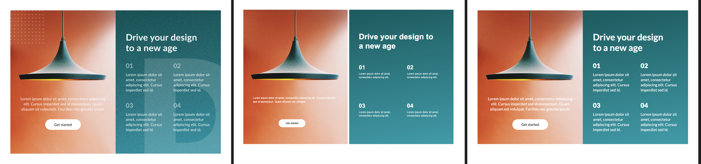
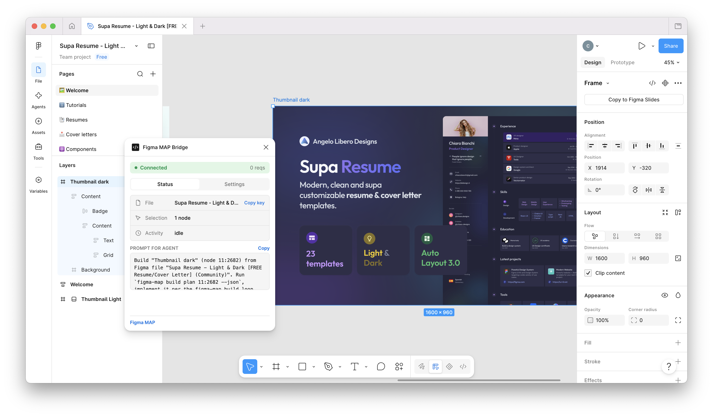
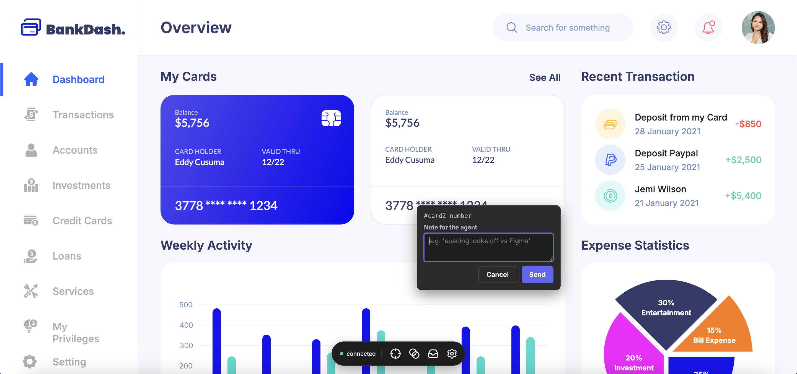
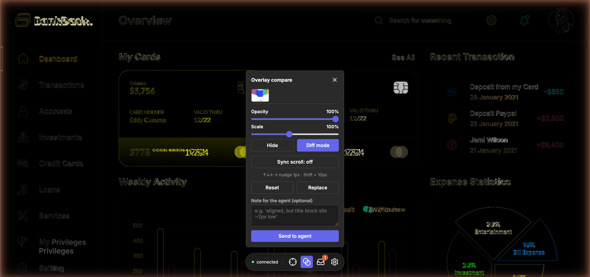

<div align="center">


# figma-map

**The ground-truth layer that lets AI coding agents build pixel-perfect UI from Figma.**

Not a screenshot to eyeball — exact structure, exact tokens, and a closed
verify loop that tells an agent precisely what's still wrong, until it isn't.

[](https://github.com/KirillBaranov/figma-map/actions/workflows/ci.yml)
[](https://pkg.go.dev/github.com/kirillbaranov/figma-map)
[](https://goreportcard.com/report/github.com/kirillbaranov/figma-map)
[](https://github.com/KirillBaranov/figma-map/releases)
[](LICENSE)

</div>

---



<p align="center"><em>Left to right: the design, an agent building by eye, an agent using figma-map's tokens + verify loop. Same agent (Claude Code, Sonnet 5), same prompt, same assets — the only variable is the tool.</em></p>

<div align="center">

| Case | Design | by eye | figma-map | Independent pixel diff |
|---|---|---|---|---|
| [Landing hero](bench/REPORT.md) | decorative, photo + gradient | 7.83% | 4.10% | **~48% closer** |
| [Landing hero 2](bench/cases/landing-hero-2/REPORT.md) | dark hero, feature cards | 8.17% | 5.98% | **~27% closer** |
| [Admin dashboard](bench/cases/admin-dashboard/REPORT.md) | real component-dense UI (sidebar, cards, charts, list) | 8.87% | 1.92% | **~78% closer** |

</div>

<p align="center">Same agent (Claude Code, Sonnet 5), same prompt, same shared assets — only the tool differs. The score is an independent pixel diff against the reference image, not figma-map's own — it can't be biased toward the treatment arm. <a href="bench/README.md">Method & caveats →</a></p>

## Install

Run this yourself, in your own terminal — **not** something to hand an
agent to execute for you. Piping a remote script into a shell is exactly
the kind of thing safety-conscious coding agents are right to refuse to do
autonomously, so figma-map's setup is designed around the human always
running this one command themselves:

**macOS/Linux:**
```bash
curl -fsSL https://raw.githubusercontent.com/KirillBaranov/figma-map/main/install.sh | sh
```

**Windows (PowerShell, not cmd.exe):**
```powershell
irm https://raw.githubusercontent.com/KirillBaranov/figma-map/main/install.ps1 | iex
```

One command, three things installed: the CLI, a standalone backend bundle
(no Node install needed to run it), and the Figma plugin (no build step
needed to load it) — no `git clone` required for any of it.

Then tell your agent (Claude Code, Cursor, Codex CLI, …):

> Read
> https://raw.githubusercontent.com/KirillBaranov/figma-map/main/.claude/skills/figma-map-setup/SKILL.md
> and follow it to set up figma-map in this project.

This one has to come from GitHub, not disk: it's the one-time bootstrap
skill that walks the agent through running `init` in the first place, so
before `init` has run once, no local copy of it exists anywhere to read
instead. (The day-to-day `figma-map` skill is the opposite — it ships
embedded in the CLI binary itself, and `init` writes it straight into your
project, no network fetch needed.) No `git clone` needed just for this —
the agent only needs to read that one file, not run anything from a
checkout.

From here the agent confirms the CLI is on `$PATH`, starts the bridge, runs
`init`, and registers itself as an MCP server for you — pausing only once,
to ask you to load the Figma plugin (the one step no agent can do on your
behalf, since it's a click inside Figma's own UI).

<p align="center"></p>

<p align="center"><em>Connected — and it already wrote the exact prompt for your agent: file, selection, node id.</em></p>

Prefer to do it by hand, or need the exact MCP config for Claude Code /
Cursor / Codex CLI? → [Manual install](#manual-install) below.

## What it is

```jsonc
// verify reconcile 55:1140 --story cta-banner
{ "match": false, "remaining": 2, "byElement": [
    { "nodeId": "55:1140", "name": "CTA", "diffs": [
        { "prop": "background-color", "is": "rgb(31,41,55)", "should": "#18181b" },
        { "prop": "padding-left", "is": "12px", "should": "16px" } ] } ] }
```

Not "does this look right," but *exactly* which element, which property,
which value — an agent can act on that and loop until it's gone.

- **A closed verify loop, not a screenshot to eyeball.** figma-map renders your
  implementation, reads its actual DOM, and diffs computed styles against the
  design's exact tokens — per-element `is → should` numbers, not vibes.
- **Ground truth before vision.** Structure, tokens, and component identity
  are read straight from Figma's data model. A vision model only steps in for
  the one thing Figma's data can't answer — *which code component is this?*
- **AI runs once, codegen runs forever.** That one vision-dependent question
  is answered once, into a reviewable binding file. Every generation and
  verification pass after that is deterministic, no LLM in the hot path.
- **MCP-native.** Point an agent at it and it gets the full CLI as typed
  tools, identical surface, zero drift.

## How it works

1. **`build plan`** → a buildable spec for a Figma node: layout, each
   component instance mapped to your code (import + props), exact tokens.
2. The **agent writes the code**, tagging each element so it can be measured
   later.
3. The agent **renders** it (Storybook or a dev server).
4. **`verify reconcile`** renders the implementation, reads its DOM, and diffs
   it against the design's exact tokens — per-element `is`/`should` numbers.
5. The agent **fixes the exact properties** and loops from step 3 until
   everything matches.

The one place vision is unavoidable is matching a Figma instance to *your*
code component — figma-map solves that once, up front, into a reviewable
`figma-map.binding.yaml`:

```text
Storybook ──scan──▶ catalog (screenshots + import paths, no AI)
Figma ──bind (vision LLM, once)──▶ figma-map.binding.yaml ──review──▶ map (deterministic) ──▶ JSX
```

A ready-made skill at [`.claude/skills/figma-map`](.claude/skills/figma-map/SKILL.md)
teaches an agent this whole loop automatically. For request-flow diagrams and
the full "ground truth before vision" decision tree, see
[docs/architecture.md](docs/architecture.md).

## Optional add-ons

Neither of these is required to get value from figma-map — they add specific
capabilities on top.

**Browser extension** — lets a human flag a mismatch on a running page and
link it straight to its Figma node, instead of a screenshot and a paragraph
of description. Also gives you a pixel-perfect overlay diff with automatic
scaling, right in the browser.

<div align="center">


</div>

<p align="center"><em>A human clicks the element that's off, notes what's wrong, and sends it — the agent gets a Figma node id and bounds, not "the card looks weird."</em></p>

**Storybook + a vision LLM key** — only needed for matching a Figma instance
to *your* code component (`setup scan` / `setup bind` / `build map`). Reading
tokens/structure from Figma, and the reconcile verify loop, work without
either.

```bash
figma-map setup scan --project /path/to/storybook-project   # catalog, no AI
figma-map setup bind                                        # match + write binding, AI, once
figma-map build map 13:1077                                 # generate code for any node
```

## Manual install

### 1. Install the CLI

**macOS / Linux:**
```bash
curl -fsSL https://raw.githubusercontent.com/KirillBaranov/figma-map/main/install.sh | sh
```

**Windows (PowerShell):**
```powershell
irm https://raw.githubusercontent.com/KirillBaranov/figma-map/main/install.ps1 | iex
```

Both fetch three things in one run: the CLI, a standalone backend bundle
(no Node install needed to run it), and the Figma plugin (no build step
needed to load it) — detecting your OS/arch, verifying each SHA-256
checksum before installing anything. Override with
`FIGMA_MAP_VERSION=v0.1.0` (or `-Version v0.1.0` on Windows) to pin a tag,
or `FIGMA_MAP_INSTALL_DIR=~/bin` (`-InstallDir` on Windows) to choose the
CLI's directory. Windows currently ships `amd64` only — no `arm64` release
yet.

Alternatives: `go install github.com/kirillbaranov/figma-map@latest`, or grab
a prebuilt archive from the [releases page](https://github.com/KirillBaranov/figma-map/releases)
— either only gets you the CLI binary, not the backend/plugin bundles, so
`bridge up` will fetch those itself on first use instead.

**Updating:** `figma-map update` owns the whole stack, not just its own
binary — it replaces the CLI, refreshes the backend bundle if it's stale
(restarting a bridge that was already running), refreshes the Figma plugin
in place (after this, just re-run it in Figma — no re-import needed), and
migrates `figma-map.yaml`'s schema if a version bump needs it. `--check`
reports whether a newer version exists without installing it; `--version
v0.6.0` pins a specific tag.

**Uninstalling:** `figma-map uninstall` removes the CLI binary, the cached
backend bundles, the unpacked plugin, and the rest of `~/.figma-map` —
nothing to hunt down by hand.

### 2. Start the bridge and load the Figma plugin

The bridge is what lets figma-map read your open Figma file directly, with no
API token and no rate limits.

```bash
figma-map bridge up   # fetches (or reuses a cached) backend bundle and starts it on :1994
```

No `--repo` needed — that flag (or `bridgeRepo` in `figma-map.yaml`) is only
for contributors building the backend from source instead of using a
release bundle.

Then, **once**, load the plugin into Figma. The installer already unpacked
it to `~/.figma-map/plugin/` — no separate download or build step, and on
macOS/Windows it opens a Finder/Explorer window at that folder for you at
the end of the install:

1. Open your Figma file (desktop app).
2. **Plugins → Development → Import plugin from manifest…**
3. Select `manifest.json` from `~/.figma-map/plugin/`. `~/.figma-map` is a
   hidden dotfolder, so a plain file-picker click-through won't find it —
   either use the Finder window the installer already opened, or jump there
   directly: **Cmd+Shift+G** on macOS (paste `~/.figma-map/plugin`), or
   paste the full path into the filename box on Windows.
4. Run it once (**Plugins → Development → Figma MAP Bridge**) — it connects
   over WebSocket to the backend you just started and stays connected while
   the file is open.

After a future `figma-map update`, this becomes just "run it again" in
Figma — no re-import, since the plugin's files refresh in place at the same
path.

Building either from source instead (e.g. for local development) still
works: `cd backend && npm install && npm run build`, then `bridge up --repo
<this checkout>`; for the plugin, `cd extensions/plugin && npm install &&
npm run build`, then point step 3 at `extensions/plugin/manifest.json` in
this checkout.

### 3. Wire it into your project

```bash
figma-map init /path/to/your/project          # skill, figma-map.yaml, MCP registration, CLAUDE.md
cd /path/to/your/project && figma-map doctor  # verify bridge, chrome, storybook, key
```

`init` registers figma-map as an MCP server in the target project's
`.mcp.json` (merged in, existing servers untouched), and never clobbers
what's already there — it prints exactly what it's about to create/change
and asks for confirmation first (`-y` to skip that for scripts).

```json
{ "mcpServers": { "figma-map": { "command": "/path/to/figma-map", "args": ["mcp"] } } }
```

- **Claude Code** reads project-root `.mcp.json` itself — nothing else to
  do, just (re)open the project and approve the server when prompted.
- **Cursor** and **Codex CLI** don't read `.mcp.json`; copy the same
  `command`/`args` pair by hand — Cursor into `.cursor/mcp.json` (project) or
  `~/.cursor/mcp.json` (global), Codex CLI into `~/.codex/config.toml`:
  ```toml
  [mcp_servers.figma-map]
  command = "/path/to/figma-map"
  args = ["mcp"]
  ```

### 4. (Optional) Load the browser extension

1. `cd extensions/browser && npm install && npm run build`
2. Open `chrome://extensions`, enable **Developer mode**.
3. **Load unpacked** → select `extensions/browser/dist`.

### Requirements

The only hard requirement is the Figma plugin (step 2 above) — everything
else is optional, and just means a specific feature won't work without it.

| Dependency | Required? | Without it |
|---|---|---|
| **Figma desktop, bridge + plugin running** (step 2 above) | **Yes** | Nothing works — this is how figma-map reads your file at all. |
| **Google Chrome / Chromium** | Optional | No headless rendering — `screenshot`, `verify reconcile`, and the browser-extension compare loop need it. |
| **Storybook 7+** running | Optional | No code-component catalog — `setup scan`/`build map` need it. Reading tokens/structure straight from Figma doesn't. |
| **OpenAI-compatible vision endpoint + key** | Optional | No component matching or prop inference — `setup bind` and the leftover-prop vision step need it (works with OpenAI, a local Ollama/llava server, or any compatible gateway). |
| **Browser extension** (step 4 above) | Optional | No human-flagged live-page issues — everything else still works without it. |

## Troubleshooting

> **Bridge disconnected? This is almost always it:** Figma freezes plugin
> execution (including the WebSocket connection) when the Figma window loses
> focus or is minimized — that's Figma's behavior, not a figma-map bug. If
> the bridge drops, you (or the agent) most likely had Figma closed, in the
> background, or minimized for a while. **Bring Figma back to the
> foreground** — the plugin reconnects on its own — and have the agent retry
> the call. No restart of the backend needed.

Other common issues:

- **`figma-map doctor` fails on "bridge"** — the backend (`:1994`) isn't
  running, or no plugin instance has ever connected to it. Run
  `figma-map bridge up`, then load/run the plugin in Figma once
  (see [Manual install → step 2](#2-start-the-bridge-and-load-the-figma-plugin)).
- **`doctor` fails on "chrome"** — no local Chrome/Chromium found; install
  one, or point `figma-map.yaml` at a binary via the chrome path setting.
- **`doctor` fails on "storybook"** — nothing is serving `index.json` on the
  configured URL; start Storybook (`npm run storybook` or equivalent) first.
- **A request stalls on a huge document** — the plugin heartbeats while it's
  still working and the backend's timeout resets on each one, so it won't
  get killed just for taking a while; but a full-document styles walk over a
  very large node count is still genuinely slow. Scope the call with
  `--depth` instead of walking the whole file (see
  [docs/architecture.md](docs/architecture.md#request-flow)).
- **Still stuck after Figma is in the foreground and reconnected** — restart
  the backend (`figma-map bridge down && figma-map bridge up`) and re-run
  the plugin once from **Plugins → Development**.

## Roadmap

Where this is headed next, in rough priority order:

- [ ] **Deeper agent ↔ issue integration** — claim an issue, report progress
  on it, close the loop without re-explaining context already captured.
- [ ] **Arbitrary-region diff selection** — drag-select any region of the
  page, not just a single node, as the unit of comparison.
- [ ] **Diff-to-fix, not just diff-to-look-at** — show the agent the actual
  visual diff for a flagged issue, not only the Figma-side tokens.
- [ ] **Large-document performance** — a full-styles walk over a very large
  node count is still genuinely slow; `--depth` is today's workaround.
- [ ] **One-click plugin/extension install** — publish to the Figma
  Community and the Chrome Web Store, so "load unpacked" stops being a step.
- [ ] **Wider `reconcile` coverage** — margins, box-shadow, and gradient
  fills aren't diffed yet.
- [ ] **Idiomatic boolean props** in codegen (`disabled` instead of
  `disabled="true"`).
- [ ] **REST-source parity** — close the gaps between the live bridge and
  the headless/CI-friendly REST backend (bound-variable resolution,
  prototyping reactions, dev-resources, annotations).

See [docs/limitations.md](docs/limitations.md) for the full, current list of
gaps — and [CHANGELOG.md](CHANGELOG.md) for what's already shipped.

## Documentation

The above is enough to get productive. For everything else:

- [docs/architecture.md](docs/architecture.md) — folder layout, request flow,
  the ground-truth-before-vision decision tree
- [docs/commands.md](docs/commands.md) — every CLI/MCP command, flags, and
  `figma-map.yaml` config
- [docs/limitations.md](docs/limitations.md) — honest, current gaps
- [docs/adr/](docs/adr) — architecture decision records
- [CHANGELOG.md](CHANGELOG.md) — release history

## Contributing

Contributions are welcome — see [CONTRIBUTING.md](CONTRIBUTING.md) for the dev
workflow, and [CODE_OF_CONDUCT.md](CODE_OF_CONDUCT.md) for community guidelines.

```bash
make build    # build the binary
make test     # run tests with the race detector
make lint     # golangci-lint
```

## License

[MIT](LICENSE) © [Kirill Baranov](https://k-baranov.ru/)
