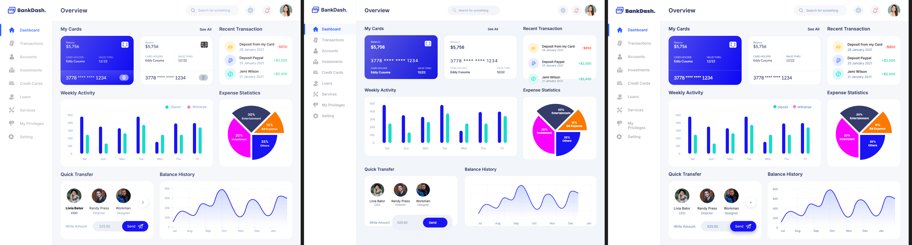

# Benchmark report: admin-dashboard

Run: manual head-to-head, 1 frame ("Main Dashboard", node `78:351`, 1440×1175,
from the public
[BankDash Dashboard UI Kit Figma community file](https://www.figma.com/community).
See [bench/README.md](../../README.md) for method and caveats.

Unlike the two landing-hero cases, this frame is a **real component-dense
admin UI**: sidebar nav, top bar, two bank-card widgets, a transaction list,
two chart widgets, an avatar/quick-transfer widget. It's the third case,
picked deliberately to exercise a different source of baseline error than
typography/color on a decorative hero — real UI components (cards, badges,
icon buttons, list rows) where an eyeballed build gets spacing and alignment
wrong across many small repeated pieces, not just one or two headline text
elements.

## Result

| Arm | Pixel diff vs design (independent) |
|---|---|
| **baseline** (design screenshot, by eye) | **8.87%** pixels differ |
| **treatment** (figma-map tokens, exact bounds) | **1.92%** pixels differ |

**Treatment was ~78% closer on the independent pixel metric** (−6.95 pp) —
by far the largest gap of the three benchmark cases so far.

*Left to right: design, baseline (by eye), treatment (figma-map tokens).*

## Read

This case shows a much bigger treatment/baseline gap (~78% closer) than
either landing-hero case (~48% and ~27%). The reason isn't that figma-map did
anything different here — it's the same tokens-in, absolute-bounds-out
approach both times — it's that **a dense component UI gives an eyeballing
agent far more places to drift**:

- **Card corner radius, gap, and padding** are all `25px`/`24px`/`24px` in
  Figma; the baseline arm guessed `20px` across the board — close enough to
  "look right" per-element, but compounding visibly across six repeated
  widgets instead of one hero section.
- **The blue "My Cards" gradient** came out as an exact two-stop linear
  gradient from the exported card background asset; the baseline arm's
  hand-picked `#5b5be0 → #1616e0` gradient was visibly duller/flatter.
- **Numeric alignment**: transaction amounts, card balances, and avatar
  labels are all pixel-exact from bounds; the baseline arm's flexbox-based
  layout drifted a few px per row, adding up over three transaction rows and
  three avatar cards.

Two things had to be handled as flattened assets rather than rebuilt from
tokens, for both arms equally: the two chart widgets (bar chart, pie chart,
line/area chart) and the four small avatar photos. figma-map's `figma tokens`
gives fills/positions per node, not chart data — rebuilding a bar chart from
individual rectangle tokens would be technically possible (each bar is its
own node with its own height) but disproportionate for what a real agent
would do (a real dashboard's chart is driven by a charting library and real
data, not hand-placed divs), so both arms use the identical exported chart
PNGs. This mirrors the original benchmark's own "shared assets are a given"
convention for photos.

## Bug found building this case

The comparator (`bench/main.go`) rendered every arm at a fixed 900px viewport
height regardless of the design's actual height, silently cropping anything
below that and comparing the crop against the design's real (non-white)
content in that region. This frame (1175px tall) was cropped by ~275px —
missing the avatars and the entire Balance History chart from **both** arms.
Fixed by rendering at the design image's own height
(`render.ScreenshotViewport(url, width, dh, 1)` instead of the fixed-900px
`render.Screenshot`). Re-running the other two cases after the fix changed
their reported numbers too (both dropped, since the previously-cropped strip
had been diluting both arms toward each other with shared white space) — see
the "Updated" notes in [bench/REPORT.md](../../REPORT.md) and
[landing-hero-2/REPORT.md](../landing-hero-2/REPORT.md).
