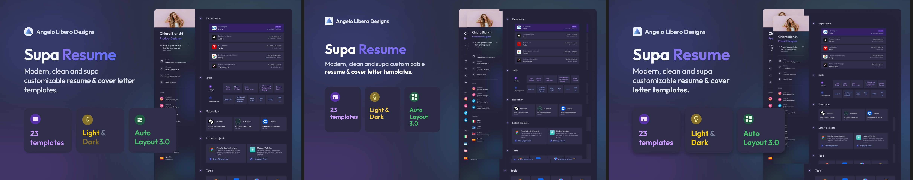

# Benchmark report: landing-hero-2

Run: manual head-to-head, 1 frame ("Supa Resume" dark thumbnail, node `11:2682`,
1600×960, from the public
[Supa Resume Figma community file](https://www.figma.com/design/1orMXtGjF1eTI5BKfisDQI/Supa-Resume---Light---Dark--FREE-Resume-Cover-Letter---Community-?node-id=11-2682).
See [bench/README.md](../../README.md) for method and caveats.

## Result

| Arm | Pixel diff vs design (independent) |
|---|---|
| **baseline** (design screenshot, by eye) | **8.17%** pixels differ |
| **treatment** (figma-map tokens, hand-placed to exact bounds) | **5.98%** pixels differ |

**Treatment was ~27% closer on the independent pixel metric** (−2.19 pp).

*(Updated 2026-07-13: numbers corrected after fixing a comparator bug — see
[bench/REPORT.md](../../REPORT.md) — that clipped the bottom of both arms at
a fixed 900px viewport height instead of this design's actual 960px.)*

*Left to right: design, baseline (by eye), treatment (figma-map tokens). Both
arms share the identical background/mockup/icon raster assets — the
difference comes from typography, spacing, and text color in the two-column
content block.*

## Read

Both arms landed close in absolute terms to the original landing-hero case
(8.17%/5.98% here vs 7.83%/4.10% there), despite this frame being smaller and
simpler (one column of text + three cards vs a full hero) — the dark
background here is busier (gradient + photo) than that frame's flatter
color regions, which costs both arms roughly equally. Where figma-map's
tokens paid off:

- **Exact spacing**: card positions (`128px / 405.33px / 682.67px` left
  offsets, 24px gaps) came straight from `figma tokens` bounds instead of
  eyeballed `20px` gaps.
- **Exact colors**: the three feature-card accent colors
  (`#c696fc` / `#f4ce10` / `#4ac06f`) matched Figma's fills exactly; the
  baseline arm's guessed hex values were visibly off-hue on the gold card.
- **Line breaks**: two of three card captions ("23 / templates",
  "Auto / Layout 3.0") wrap at a specific point that isn't recoverable from
  a screenshot alone without checking the actual text box width — figma-map's
  bounds made the 189px content width explicit.

One real limitation surfaced building this case: the two-color text runs
("Light" gold / "&" grey / "Dark" gold, and "Supa" white / "Resume" purple)
report as `fontFamily: "mixed"` rather than per-run colors — `figma tokens`
gives the dominant per-node style, not per-character overrides, so those
exact hex values were pixel-sampled from the design screenshot by hand
instead of read from the API. Tracked as a gap, not silently guessed.
