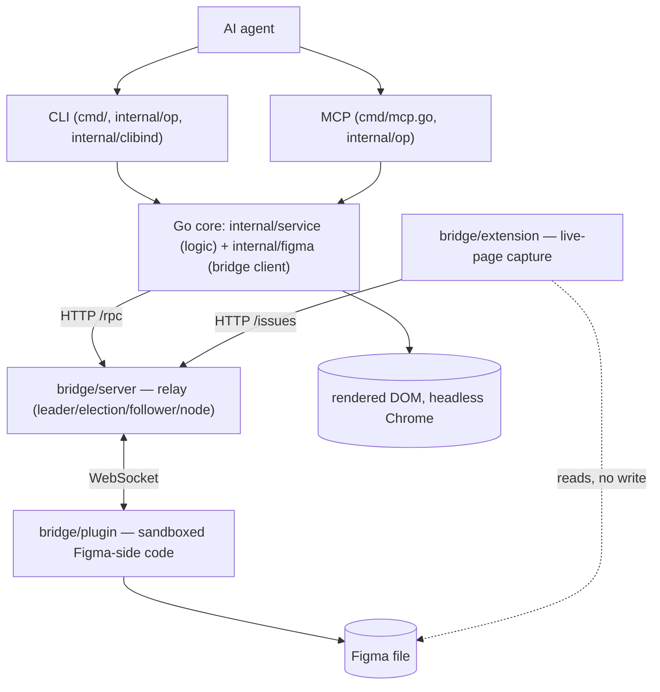

# ADR-0002: Layer boundaries and responsibilities

- Status: accepted
- Date: 2026-07-02

## Context

The system has grown six distinct layers across two repos-worth of code living
in one tree: the Figma plugin, the bridge server, the browser extension, the
Go core, and the CLI/MCP frontends on top of it. Each was added at a different
time for a different reason, and nothing wrote down what each layer is and
isn't allowed to do. Without that, it's easy for a "quick fix" to leak logic
across a boundary (e.g. the extension computing a diff instead of just
capturing ground truth, or `internal/op` growing business logic instead of
just declaring a schema).

This ADR is a snapshot, not a plan: it fixes the current boundaries in
writing so future changes have something concrete to violate-or-not, rather
than a boundary that only exists as convention.

## Decision

Six layers, one direction of dependency (top calls down, never sideways
across a layer, never up):

### 1. Figma plugin (`bridge/plugin`)

**Owns:** the only code with live access to the Figma document. Serializes
nodes/styles/variables, answers RPC calls over the WebSocket.
**Never:** decides anything, knows who's asking (CLI vs MCP vs extension are
indistinguishable to it), retains state across requests.
**Provenance:** forked from
[gethopp/figma-mcp-bridge](https://github.com/gethopp/figma-mcp-bridge) (MIT,
see `bridge/NOTICE.md`). `code.ts`/`serializer.ts` are majority original,
extended in place (Variables, GRID autolayout, prototyping, extra style
fields). `App.tsx` (the in-Figma panel UI) has been substantially rewritten.

### 2. Bridge server (`bridge/server`)

**Owns:** transport only. WebSocket session to the plugin, leader/election
across multiple CLI processes sharing one Figma connection, RPC relay
(`/rpc`), and the extension's issue inbox (`/issues` — in-memory, stateless
by design, no persistence across restarts).
**Never:** measures, diffs, or judges correctness. `IssueStore` is a CRUD
inbox, not a decision-maker — flagging an issue is a capture event, acking it
is a "handled" event, and figma-map's own ops (`verify pixeldiff-images`) do
any actual comparison.
**Provenance:** `leader.ts`/`election.ts`/`follower.ts`/`node.ts`/`index.ts`
are unmodified since the fork (9ad44d3) — this is still gethopp's
leader-election design, untouched.
**Two separate contracts, one process:** `/rpc` (CLI/MCP ↔ plugin, the
volatile wire protocol that evolves with the Go side) and `/issues` (extension
↔ bridge, a small stable REST surface). Changes to one must not leak into the
other's shape.

### 3. Go core (`internal/figma` + `internal/service`)

The "dumb tool" from [ADR-0001](ADR-0001-dumb-tool.md).
**`internal/figma`:** transport client to the bridge (HTTP/WS) and the
`Source`/`IssueSource` interfaces. No decision logic.
**`internal/service`:** all logic — what to measure, when to call the vision
LLM, how to shape results. `IssueSource` is deliberately not part of the
general `Source` interface (see `issues.go:24`): issues are page captures
relayed by the bridge process, not Figma data, and folding them into `Source`
would force every fake/implementation to handle a capability that isn't
actually Figma-shaped.
**Invariant:** this layer never decides "is this wrong" — it returns a
number (diff%, match bool) and lets the agent decide.

### 4/5. CLI and MCP (`cmd/`, `internal/op`, `internal/clibind`)

One layer, two frontends, generated from a single declaration
(`internal/op.Registry`) so they cannot drift — enforced by a convergence
test. **Never:** put business logic in `registry.go`; an `Op.Run` should call
straight into `internal/service` and the `Render` func should only format,
not compute.

### 6. Browser extension (`bridge/extension`)

**Owns:** ground-truth capture from a live page a human is looking at —
screenshot, bounding box, CSS selector, and (via `lib/hitmap.ts`) resolving a
click to the specific Figma node it corresponds to, using the plugin's node
tree instead of guessing from pixels. Posts capture events to
`bridge/server`'s `/issues`.
**Never:** compute a diff or judge match/mismatch client-side — that stays in
`verify pixeldiff-images` per ADR-0001. Confirmed still true as of this ADR
(`CompareOverlay.tsx:354` defers to the Go-side op explicitly).
**Provenance:** 100% original, not part of the gethopp fork. Talks to bridge
only over the stable `/issues` REST contract, never the plugin's RPC wire
protocol — this is what makes it safe to evolve or repackage independently of
`bridge/plugin`/`bridge/server`.
**Known debt (not yet fixed):** `content/CompareOverlay.tsx` (625 lines)
mixes view (drag/resize/opacity), data-fetch orchestration
(`fetchFigmaScreenshot`, `getFigmaSubtree`), hit-testing, and persistence in
one component, even though the underlying `lib/*` modules are already cleanly
split. The fix, when picked up, is an orchestration hook (e.g.
`content/useCompare.ts`) between `lib/*` and the view so `CompareOverlay.tsx`
becomes view-only.

## Consequences

- A layer's boundary is defined by what it talks to, not by its repo
  location: `bridge/server` and `bridge/extension` are already two different
  products glued together by one HTTP contract, regardless of whether they
  ever get split into separate repos.
- The RPC wire protocol (`/rpc`, plugin ↔ Go core) is the one boundary that
  must change in lockstep across `bridge/plugin` and `internal/figma` — this
  is why it stays vendored in-tree rather than an external dependency.
- `/issues` (extension ↔ bridge) is stable and small enough that the
  extension does not have this constraint — a future decision to repackage
  it as its own product (tracked separately, not decided by this ADR) would
  not reintroduce wire-protocol drift.
- Fork attribution (`bridge/NOTICE.md`) stays regardless of how much of
  `bridge/plugin`/`bridge/server` has since diverged — MIT requires it, and
  `election.ts`/`follower.ts`/`node.ts`/`index.ts` are still verbatim
  upstream today.
