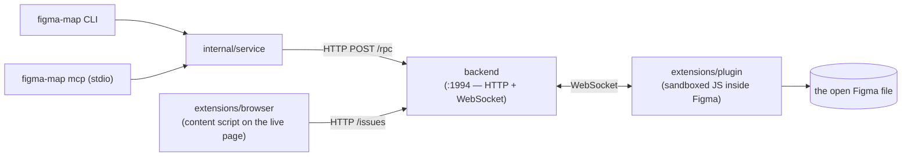
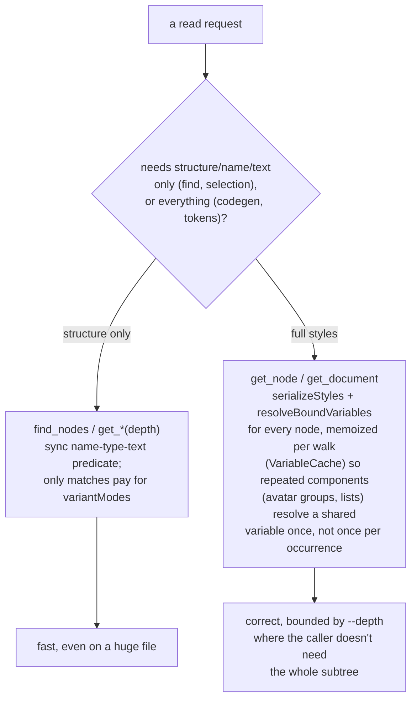
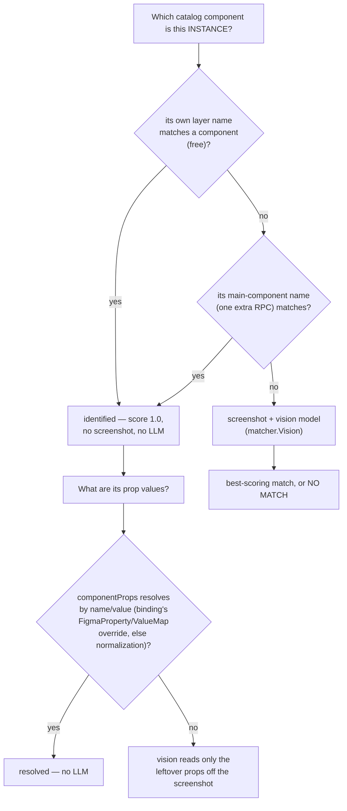

# Architecture

> This is the deep technical reference. If you just want to know what
> figma-map is and how to install it, see the [README](../README.md).

```text
cmd/                 cobra root + `figma-map mcp`
internal/
  op/                operation registry — one declaration → CLI command + MCP tool
  clibind/           binds an input struct to cobra flags/args (same tags as MCP)
  service/           all logic (deterministic-first; lazy LLM)
  config/            figma-map.yaml + env override
  figma/             Source interface + bridge/REST backends; node tokens (Style)
  storybook/         index.json → catalog; chromedp screenshots; import parsing
  render/            chromedp DOM extraction (computed styles) + screenshots
  matcher/           Matcher interface + vision implementation; ground-truth name match
  binding/           figma-map.binding.yaml model (load/save)
  codegen/           binding + props → JSX
  llm/               OpenAI-compatible vision client (configurable base URL)
backend/             leader/election relay + persistent data plane (:1994) —
                     /rpc for CLI/MCP, /issues + /compare-session for the
                     extension, persisted to ~/.figma-map/backend/*.json
extensions/
  plugin/            sandboxed JS inside Figma — node/style/variable serialization
  browser/           browser extension — flags live-page issues, links them to a Figma node
```

Each operation is declared once in `internal/op`; the CLI subcommand and the MCP
tool are both generated from it, so they cannot drift (enforced by a convergence
test). The `figma.Source` and `matcher.Matcher` interfaces are extension seams:
a Figma REST backend (`figma.source: rest`, for headless/CI) already ships
behind `figma.Source` with zero changes to any caller; an embedding-based
retriever for large libraries could be added the same way behind
`matcher.Matcher`. Layer boundaries and what
each is/isn't responsible for are fixed in
[ADR-0002](adr/ADR-0002-layer-boundaries.md).

## Request flow

Nothing talks to Figma directly — every read/write goes through the backend, which
relays it over a WebSocket to a plugin running inside the open Figma file. The
backend also fronts a second, unrelated contract for the browser extension —
flagging an issue on a live page never touches the RPC/WebSocket path at all:



`capture issues` / `capture ack` (CLI/MCP) read that same inbox — a human flags
a mismatch in the browser, the agent picks it up as structured ground truth
(screenshot, bounds, linked Figma node id), never a raw pixel guess.

The backend doesn't cap a request at a flat wall-clock limit — the plugin
sends a heartbeat every few seconds to prove it's still alive, and the
backend's sliding inactivity timeout resets on every one of those, so a
request that's genuinely still working (thousands of nodes, each
round-tripping through Figma's own plugin API) doesn't get killed just for
being large. A request only dies if the plugin goes silent past its grace
window, or if real progress (an actual data chunk, not just a heartbeat)
stalls past a separate ceiling (`backend/src/bridge.ts`). That said, fully
resolving styles/variables across a whole large document is still slow in
practice, not just theoretically timeout-safe — see
[Limitations](limitations.md) and the [Roadmap](../README.md#roadmap). So the
plugin offers two shapes of fetch, and each `internal/service` operation
picks the cheap one whenever it can:



`get_main_component_name` and dev-resources (`getDevResourcesAsync`, Dev-Mode-
only) follow the same rule: a separate, narrow call paid for only by the one
node that actually needs it, never folded into the bulk walk every other
operation shares.

## Ground-truth before vision

`bind`/`map`/`plan` only call the vision model once every cheaper, deterministic
signal Figma already gives has been tried and failed:



The same principle extends to raw values: a fill bound to a Figma Variable with
a designer-set WEB `codeSyntax` (e.g. `--color-brand-primary`) renders as
`var(--color-brand-primary)` instead of a literal hex — ground truth from the
design file, not a guess at the project's token names.

## Further reading

- [ADR-0001: the tool is dumb, the agent is smart](adr/ADR-0001-dumb-tool.md)
- [ADR-0002: layer boundaries](adr/ADR-0002-layer-boundaries.md)
- [ADR-0003: backend consolidation](adr/ADR-0003-backend-consolidation.md)
- [ADR-0004: extensions layout](adr/ADR-0004-extensions-layout.md)
- [ADR-0005: backend fork removal](adr/ADR-0005-backend-fork-removal.md)
- [Commands & configuration reference](commands.md)
- [Limitations](limitations.md)
