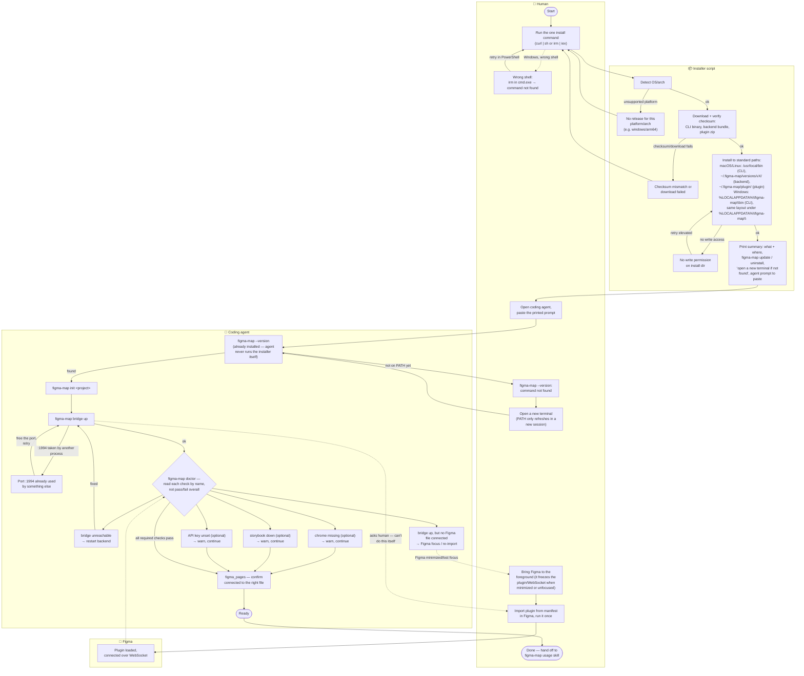
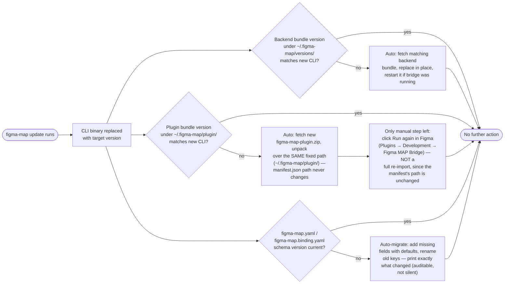

# Onboarding flow

The target install flow, once the single-installer redesign lands (see
[CHANGELOG.md](../CHANGELOG.md) and the `figma-map-plugin.zip` release asset
already shipping today). Renders natively on GitHub — no export step.

Lanes: **Human**, **Installer script** (`install.sh` / `install.ps1`),
**Coding agent**, **Figma**.

Covers three failure categories, not just the happy path:

- **A — pre-CLI failures**: nothing is installed yet, so `doctor` can't help;
  these need their own explicit dead-ends/retries.
- **B — post-install failures**: `doctor`'s five checks are the single
  diagnostic hub — each has its own named fix, and the optional ones
  (Chrome/Storybook/API key) must not block moving on.
- **C — version drift**: `figma-map update` only updates the CLI binary;
  backend/plugin can go stale independently (see the second diagram below).

## Version drift — `figma-map update` must own the whole stack, not just the CLI

`figma-map update` today only replaces the binary in place; it doesn't know
whether the backend bundle or the plugin it already fetched are still the
matching version. Left unhandled, this silently reintroduces category-B
failures (a newer CLI talking to a stale backend/plugin) well after the
initial install succeeded. The target design pushes every step that
*can* be automated into `update` itself, so the only thing ever left for
the human is the one thing Figma doesn't let anything else do.

The plugin branch depends on Figma actually picking up on-disk changes when
a dev plugin already imported from a given `manifest.json` path is re-run —
worth confirming against real Figma behavior before relying on it, since
it's what turns "re-download, unzip, re-import" into "click run".

## Why the human runs the installer, not the agent

Piping a remote script into a shell autonomously is a pattern many
safety-tuned coding agents categorically refuse (asking, then treating any
justification the agent gives itself, doesn't help — it's a hard rule for
some). Making the human the one who always runs the installer removes the
failure mode entirely instead of working around it: the agent's first
action is `figma-map --version` against a binary that's already there,
which is a normal invocation, not an execution-of-untrusted-code decision.

## Uninstall / update

- `figma-map update` — fetches and swaps in the latest release for the
  current platform (already shipped, see `cmd/update.go`); see the
  version-drift diagram above for what it does *not* handle yet.
- `figma-map uninstall` — planned; should remove the CLI binary, the
  backend bundle under `~/.figma-map/versions/`, and offer to remove the
  unpacked plugin directory, without requiring the human to remember every
  path by hand.
